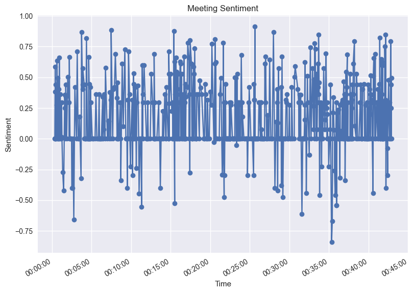

# Meeting summary

Summarize meetings from Microsoft Office Transcriptions. 

This script will summarize a conversation collected by the Microsoft Transcript app. The transcription app breaks the conversation into pairs of lines, each line contains:
 
- A transcript of what was said
- A voice and timestamp.
 
I need a summary of what was said and three main points. Along with the top ten keywords for positive, negative, and neutral sentiment.
 
A timeline of terms being talked about along with sentiment.
 
For reach speaker I need:
 
A summary of what they talked about. And then a the top ten keywords for each speaker by positive, negative, neutral sentiment.

